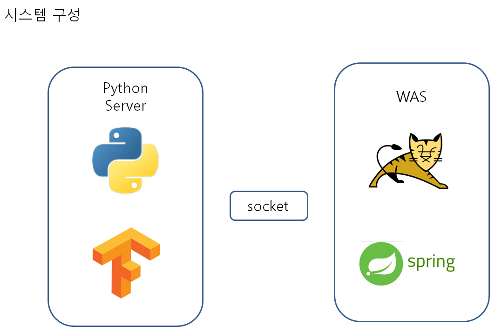

# TensorFlow(텐서플로) CNN을 이용한 CIFAR-10 실시간 이미지 분류 구현

웹에서 실시간으로 이미지 분석 결과가 표시될 수 있도록 구현


##시스템 구성




## CIFAR-10 데이터 셋 - 아래와 같이 10개의 레이블로 이루어진 데이터 셋

각각의 레이블은 32 X 32 사이즈로 되어 있다.
50,000개의 training 데이터셋 파일 
10,000개의 test 데이터셋 이 존재


**CIFAR-10 데이터셋의 구성** 


##1. RealtimeImageRecognition 디렉토리 => 웹 서버

```sh
개발 환경 : spring framework, gradle, spring boot

기능 : 파일 업로드, 업로드된 파일 이름을 분석 서버에 전송
```

##2. cifar-test 디렉토리 => 분석 서버

###이미지 분석 소스 코드
https://github.com/exelban/tensorflow-cifar-10 => 소스코드 사용

```sh
개발 환경 : python, tensorflow,

기능 : 소켓 서버, training, predict 
```

###파일 설명

```sh
train.py

training 데이터셋으로 데이터를 학습 한다.

학습 결과는 ./tensorboard/cifar-10-v1.0.0/ 디렉토리에 저장된다.
```

```sh
predict_1.py

training에서 만들어진 결과 파일을 읽어 온 후 예측할 데이터를 비교하여 최종 결과(예측 결과)를 만들어 낸다.
```

```sh
include/model.py

training을 하기 위한 CNN 모델
```

```sh
include/model_1.py

예측 하기 위한 모델.
모델 형태는 training과 같다. 예측하기 위해 데이터 입력 부분 수정.
```

```sh
socket_server.py

요청 데이터를 받기 위한 서버
```

```sh
client.py

메세지 전송 테스트를 위한 클라이언트
```

```sh
test_batch_image_load.ipynb

테스트 데이터 셋 파일에서 데이터를 읽어서 이미지로 저장한다.
```

```sh
test_image_10.png ~ test_image_19.png

test_batch_image_load.ipynb 파일로 부터 저장한 테스트 이미지
```